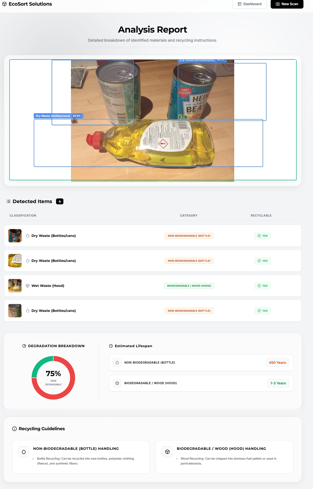
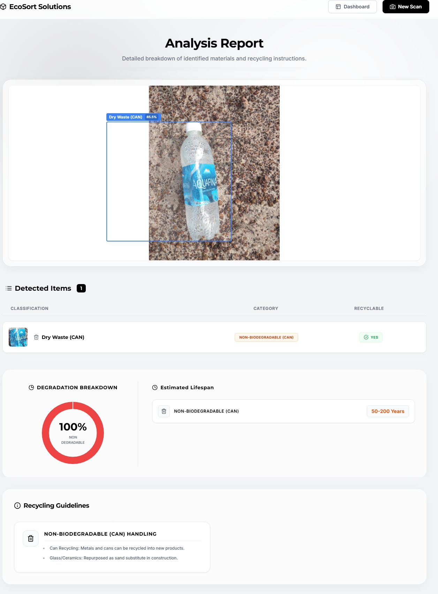

# EcoSort: AI-Powered Multi-Waste Classification System

**EcoSort** is a real-time computer vision and IoT platform built on **YOLOv8** that detects and classifies multi-waste using images, videos, and live webcam feeds.

---

## 馃専 Key Features

* 鈿� **Real-Time Detection:** Identifies waste types instantly via images or live webcams using YOLOv8.
* 鈴� **Decomposition Insights:** Provides degradation timelines for detected items.
* 鈾伙笍 **Recycling Guidance:** Offers smart recycling and disposal suggestions.
* 馃搳 **Smart Bin Dashboard:** Monitors live waste accumulation and bin capacity.

---

## 鈿欙笍 Requirements

This project was developed using **Python 3.8+**, and the backend is powered by **Flask** along with **YOLOv8** for computer vision.

### 馃摝 Required Libraries
Make sure to install the following dependencies before running the project:
* `flask` 鈥� powers the web framework and server routing.
* `flask-cors` 鈥� handles Cross-Origin Resource Sharing for API requests.
* `ultralytics` 鈥� provides the YOLOv8 framework for waste detection, classification, and tracking.
* `opencv-python` 鈥� handles real-time video streaming, image reading, and bounding box processing.
* `numpy` 鈥� used for numerical computations and array handling.
* `base64` / `uuid` / `datetime` 鈥� built-in modules for image encoding, unique file naming, and event timestamps.

---

## 馃摜 Installation

Install all required dependencies using `pip`:

```bash
pip install -r requirements.txt
```

---

## 馃摜 Download / Clone the Repository

You can clone the project repository via Git:

```bash
git clone https://github.com/Thamizhmani-M/Waste-Classification.git
cd Waste-Classification
```

---

## 馃搨 Repository Structure

Once downloaded or cloned, your directory structure will look like this:

```text
EcoSort-Solution/
鈹�
鈹溾攢鈹€ static/                    # Static assets
鈹�   鈹溾攢鈹€ crops/                 # Detected waste object crops
鈹�   鈹溾攢鈹€ uploads/               # Uploaded images and videos
鈹�   鈹斺攢鈹€ *.png                  # UI assets (index, steps 1-5)
鈹�
鈹溾攢鈹€ templates/                 # Flask HTML templates
鈹�   鈹溾攢鈹€ dashboard.html         # Smart bin & analytics dashboard
鈹�   鈹溾攢鈹€ detect.html            # Main detection interface
鈹�   鈹溾攢鈹€ geo_analytics.html     # Waste location analytics
鈹�   鈹溾攢鈹€ how-it-works.html      # System workflow guide
鈹�   鈹溾攢鈹€ image_detection.html   # Image processing
鈹�   鈹溾攢鈹€ image_result.html      # Image detection results
鈹�   鈹溾攢鈹€ index.html             # Landing page
鈹�   鈹溾攢鈹€ live-detection.html    # Real-time webcam feed
鈹�   鈹溾攢鈹€ login.html             # User login
鈹�   鈹溾攢鈹€ video-detection.html   # Video processing
鈹�   鈹斺攢鈹€ video-result.html      # Video detection results
鈹�
鈹溾攢鈹€ Testing images/            # Dataset for model validation
鈹溾攢鈹€ app.py                     # Main Flask backend & YOLOv8 integration
鈹溾攢鈹€ data.yaml                  # Dataset configuration
鈹溾攢鈹€ requirements.txt           # Python dependencies
鈹溾攢鈹€ test_model.py              # Model testing script
鈹斺攢鈹€ yolov8x.pt                 # Pre-trained YOLOv8 weights
```

---

## 鈿欙笍 How It Works

The system processes multi-waste through multiple input modes integrated into the Flask application (`app.py`):

### 馃摜 Input Modes
* **Image Detection:** Upload static images via `image_detection.html` to instantly classify and localize waste items.
* **Video Detection:** Upload video files to track and process frames sequentially.
* **Live Webcam Detection:** Real-time stream processing (`live-detection.html`) using OpenCV and YOLOv8.

### 馃攳 Detection & Classification
* The model identifies objects using `yolov8x.pt` and maps them to municipal categories (Wet Waste, Dry Waste, E-Waste, Hazardous Waste).
* Generates bounding boxes with confidence scores and saves cropped item images into `static/crops/`.

### 馃搳 Smart Insights & Dashboard
* **Decomposition Timelines:** Displays degradation duration (e.g., 2鈥�4 weeks for organic, 400+ years for plastic).
* **Recycling Suggestions:** Provides actionable disposal or recycling steps.
* **Smart Bin Dashboard:** Tracks live bin capacity, impact scores, and CO2 saved metrics.

---

## 馃 Model Information

This project utilizes the **YOLOv8x (Extra Large)** pre-trained model. It is a highly robust base model originally trained on the COCO dataset, capable of detecting 80 different general objects.

### Official YOLOv8x Performance Metrics:
* **mAP50-95 (Overall Accuracy):** 53.9%
* **mAP50:** ~71.0%
* **Parameters:** 68.2 Million
* **Speed (Inference):** Highly optimized for real-time performance.

---

## 馃摜 Model Download & Setup

Due to GitHub's file size restrictions, the large model file (`yolov8x.pt`) is hosted externally. To run this project successfully on your local machine, follow these steps:

1. **Download the Model:**  
   [Download yolov8x.pt from Google Drive](https://drive.google.com/drive/folders/1D_1-7cz8uvaRBcpJ4KQxso5-e5BAOgxN)

2. **Place in Repository:**  
  Once downloaded, place the `yolov8x.pt` file directly into the root directory of this project so it matches the repository structure.

3. **Run the Project:**  
   After placing the model, start the application by running:
    ```bash
     python app.py
     ```
---
 ## 馃柤锔� Visual Examples

  Sample detection outputs and analysis results from EcoSort:

* **Analysis 1:** 
* **Analysis 2:** 

                  ---

## 馃搳 Dataset & Class Mapping Configuration

 This project leverages the highly accurate YOLOv8x pre-trained model, which was trained on the COCO (Common Objects in Context) dataset. Instead of training a custom dataset from scratch, the system intelligently maps general COCO object classes to specific municipal waste categories in real-time.

    馃敆 **Dataset Reference:** COCO Dataset (80 Classes) (Used via `yolov8x.pt` weights)

 ### 馃攧 Dynamic Waste Mapping Logic
    The backend seamlessly intercepts the standard detected objects and categorizes them into appropriate waste management bins:

      * 馃崗 **Wet Waste (Organic & Food)**  
         * **Mapped Items:** Bananas, apples, sandwiches, broccoli, potted plants, etc.  
         * **Disposal:** Biodegradable (Composting & Biogas).

      * 馃搫 **Wet Waste (Paper & Wood)**  
         * **Mapped Items:** Books, wood/wood objects, etc.  
         * **Disposal:** Biodegradable / Recyclable (Composting & Paper Recycling).

      * 馃イ **Dry Waste (Plastic, Bottles & Cans)**  
         * **Mapped Items:** Bottles, umbrellas, backpacks, ties, sports balls, forks, spoons, etc.  
         * **Disposal:** Recyclable (Melted for furniture, new bottles, or road construction).

      * 馃捇 **E-Waste**  
         * **Mapped Items:** Laptops, cell phones, TVs, microwaves, traffic lights, etc.  
         * **Disposal:** Hazardous but recyclable (Extraction of precious metals).

                     ---

 ## 馃弸锔忊€嶁檪锔� Train the Model with Your Dataset

    While this project uses a pre-trained YOLOv8x model by default, you can fine-tune it on your own custom waste classification dataset using a training script.

    Ensure your custom dataset is formatted correctly (YOLO format) and the paths are updated in the `data.yaml` configuration file.

   ### Training Script (`train_script.py`)
             ```python
     from ultralytics import YOLO

      # 1. Load the pre-trained base model
     model = YOLO('yolov8x.pt') 

      # 2. Train the model on your custom dataset
     results = model.train(data='data.yaml',  
        epochs=50,         # Adjust epochs based on your dataset size
        imgsz=640,         # Image resolution
        batch=16,          # Batch size
        name='ecosort_custom_model' )
                ```

   ### How to Run
    To initiate the training process, execute the following command in your terminal:
       ```bash
       python train_script.py
       ```
   ### Post-Training Steps
        1. Once training is complete, fine-tuned weights will be saved in `runs/detect/ecosort_custom_model/weights/`.

        2. Locate the best weight file (e.g., `best.pt` or `yolov8x.pt`).

        3. Replace the model path in your `app.py` file with this new custom weight file to run predictions on your locally trained classes.
        ---
## 馃殌 Future Enhancements

    1. 馃摴 **Video Stream Analysis:** Continuous real-time video analytics and processing pipeline.
    2. 馃幆 **More Categories & Fine-tuning:** Add additional waste sub-categories and fine-tune model parameters for higher accuracy.
    3. 馃攰 **Voice Feedback:** Integrated real-time voice feedback system to announce detected waste categories aloud.